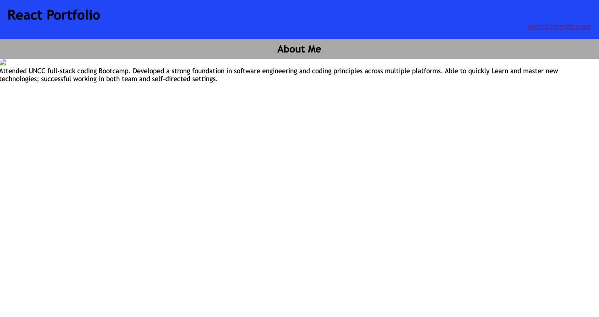

# React portfolio
portfolio built using React and Bootstrap. I'm continually adding projects, modifying content, and updating the look and functionality. 


## Table of Contents 


* [Installation](#installation)

* [Usage](#usage)

* [About Me](#about)

* [Credits](#credits)
​


## Installation

To build a similar, single page portfolio or website for yourself, you'll want first create a new React app:
```
npx create-react-app <projectname>
```

Then for the single page, smooth scrolling, install react-scroll. To deploy to Github Pages, install gh-pages:
```
npm install react-scroll gh-pages
```
You can also fork and clone this repo to use as a template and then just run npm install

## Usage

You'll be able to run the app locally by running npm start:
```
npm start
```
 Every time you want your deployed site to update with the changes you've made, you need to run npm run deploy

 ```
npm run deploy
```
### Main
  * Basic about with main navbar links and link to the full bio

  ### About
  * Bio page with more about me

  ### Resume
  * Link to standard resume

### Contact
  * Email, and Github

  ## Visuals



  ## Credits

  Greg Chambers
  - [Repository](https://github.com/Gcoder9/Gcoder9.github.io)